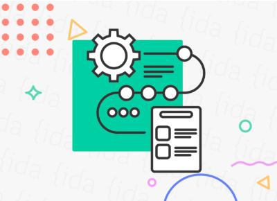
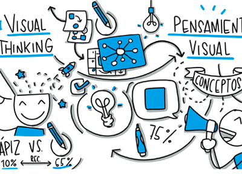
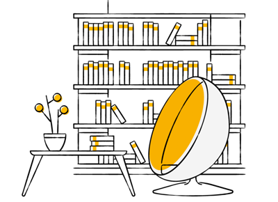

# 🧠 Contenido técnico del Bootcamp UX

Este espacio tiene como objetivo ser una fuente de consulta de información y ayuda en tu proceso de aprendizaje, todo el contenido que ves aquí ha sido recopilado y redactado por nuestro equipo de Bootcamp.

Recuerda que parte importante de tu aprendizaje es el investigar y potenciar tus conocimientos con distintas fuentes de información y este espacio es uno de ellos.&#x20;

### **¿Cómo usar este book?**

Te detallamos que puedes encontrar en cada una de las secciones

<table data-view="cards"><thead><tr><th align="center"></th><th></th><th></th></tr></thead><tbody><tr><td align="center"><strong>Proceso de diseño</strong></td><td></td><td><a href="proceso-de-diseno/">Metodologías para el proceso diseño, objetivos de cada una y detalle en que momento usarlas.</a></td></tr><tr><td align="center"><a href="toolkit-herramientas-y-tecnicas.md"><strong>Toolkit</strong></a></td><td></td><td><a href="toolkit-herramientas-y-tecnicas.md">Muchas herramientas y técnicas que te ayudarán en cada  etapa del proceso de diseño.</a></td></tr><tr><td align="center"><a href="biblioteca-de-recursos.md"><strong>Biblioteca de recursos</strong></a></td><td></td><td><a href="biblioteca-de-recursos.md">Encontrarás información como  recursos que te ayudarán a entender mejor cada etapa.</a></td></tr></tbody></table>

