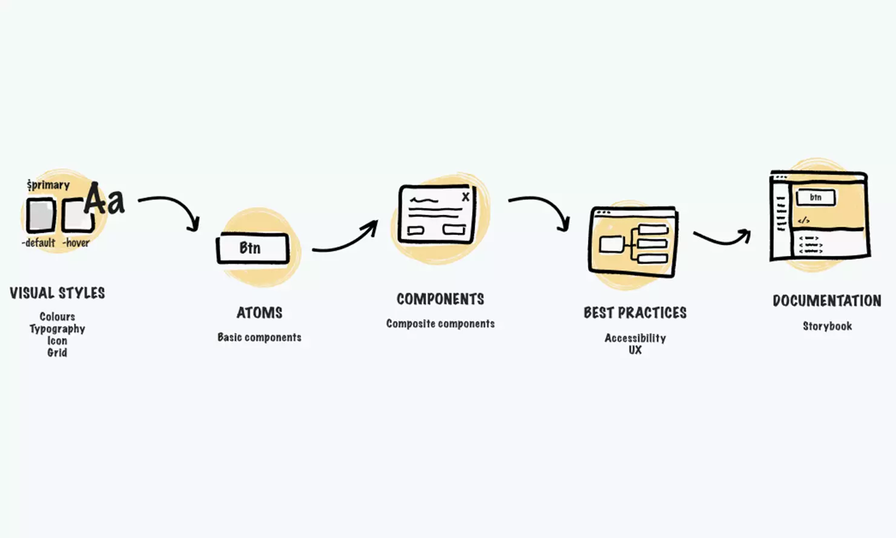

# Mi primer Design System

**Tu misión como UI designer será cambiar el **_**look\&feel**_** de un sitio web o aplicación, creando un sistema de diseño que utilice principios de diseño visual para potenciar su estética.**

En este proyecto, puedes elegir la plataforma que quieras! Te recomendamos seleccionar un sitio web o aplicación con claras carencias de diseño visual, ya que será más evidente la transformación en un antes y un después.

<figure><figcaption>
Fuente: <a href="https://this.isfluent.com/blog/2022/without-a-design-system-your-digital-product-development-is-missing-out">Fluent</a>.
</figcaption></figure>

## Objetivos de aprendizaje

La mayoría de OAs fueron cubiertos durante el periodo del bootcamp, sin embargo, los volveremos a practicar en esta ocasión para profundizarlos o reforzarlos según sea necesario. Añadimos nuevos OAs relacionados con los principios de Diseño Visual, área que cae fuera del campo de UX pero que sirve como base teórica.

<table data-column-title-hidden data-view="cards"><thead><tr><th></th><th></th><th></th></tr></thead><tbody><tr><td><strong>Diseño visual</strong></td><td><ul><li>Crear paletas de color armónicas</li><li>TBD (composición)</li><li>TBD (tipografía)</li><li>TBD (iconografía)</li></ul></td><td></td></tr><tr><td><strong>Concepto de diseño</strong></td><td><ul><li>Buscar inspiración</li><li>Idear soluciones</li><li>Priorizar ideas</li></ul></td><td></td></tr><tr><td><strong>Diseño de interfaces</strong></td><td><ul><li>Crear propuesta de diseño visual</li><li>Utilizar principios de accesibilidad</li><li>Implementar diseño responsivo</li></ul></td><td></td></tr><tr><td><strong>Prototipado</strong></td><td><ul><li>Crear prototipos en alta fidelidad</li><li>Utilizar interacciones avanzadas</li></ul></td><td></td></tr><tr><td><strong>Especificaciones de diseño</strong></td><td><ul><li>Organizar documentos de Figma</li><li>Documentar casos de uso</li></ul></td><td></td></tr><tr><td><strong>Sistemas y librerías de diseño</strong></td><td><ul><li>Implementar Atomic Design</li><li>Utilizar sistemas de diseño</li></ul></td><td></td></tr></tbody></table>

## Hitos por alcanzar

Para completar este proyecto y alcanzar los objetivos propuestos, es necesario que logres los siguientes hitos:

Inventario UI

Realiza un inventario visual de todos los elementos y componentes que existen actualmente en la plataforma digital que elegiste. Busca las inconsistencias, como por ejemplo, diferentes formas de seleccionar una fecha o introducir una dirección.&#x20;

Algunos elementos que puedes incluir son patrones, colores, estilos de textos, iconos, espaciados, layouts y demás.

Guía de estilos de marca

Crea una guía básica de estilos de marca que incluya:

* Colores primarios y secundarios
* Tipografía(s)
* Iconografía

Asegúrate de crear una paleta de color armónica según la teoría del color, que transmita el mensaje de la marca (semántica) y cumpla con los requerimientos básicos de accesibilidad. Apóyate en herramientas de inteligencia artificial o herramientas tradicionales que te ayuden a crear y analizar tu propuesta de colores.

Adaptación del sistema de diseño

Aplica tu guía de estilos a componentes y elementos de interfaces digitales, recuerda utilizar los principios de Atomic Design para que tu diseño sea consistente.

Para crear tu propio sistema de diseño, utiliza como base la librería de componentes de Material Design by Google y modifícala para que se ajuste a tu propuesta.

Debes documentar los casos de uso permitidos para los elementos, así como las especificaciones de los diferentes estados de los componentes, como ejemplo, estados activos, deshabilitados y presionados de los botones.&#x20;

Incluye la nomenclatura adecuada para los elementos, estados y componentes.

Propuesta de diseño

Crea un prototipo navegable de alta fidelidad con estos componentes, donde rediseñes las páginas principales en versión desktop y mobile.&#x20;

Experimenta con interacciones avanzadas como carruseles, menú colapsable y otros, pero toma en cuenta que es un prototipo y tiene ciertas limitaciones, por lo que nunca será una réplica exacta de un sitio o aplicación web.

Ordena tu archivo de Figma, nombrando las capas y organizando los elementos mediante frames y grupos. Recuerda que no existe una única manera  (ni una manera correcta) de estructurar tu archivo, enfócate en que sea intuitivo y fácil de utilizar para otras diseñadoras o para ti misma en el futuro.

## Consideraciones

* Decide si quieres trabajar de forma individual o en pareja. Si decides trabajar en equipo, busca alguna compañera que sea parte de esta ruta y desee practicar el mismo proyecto.
* Queremos que te enfoques en los aspectos visuales del diseño, por lo que no hemos agregado tareas de investigación de usuario ni de validación de usabilidad. Utiliza el proyecto como un campo de experimentación visual y deja volar tu creatividad.
* Comparte tus avances con otras compañeras para que te den retroalimentación y puedas iterar en el transcurso del proyecto. Cuentas con una comunidad poderosa de mujeres que apoyan tu crecimiento profesional.


Aprovecha la oportunidad de enfocarte en áreas que sientas aún retadoras y fortalecer OAs que no hayas podido profundizar anteriormente. Poco a poco te sentirás más segura para desenvolverte en tus entrevistas técnicas durante tu búsqueda de empleo.


