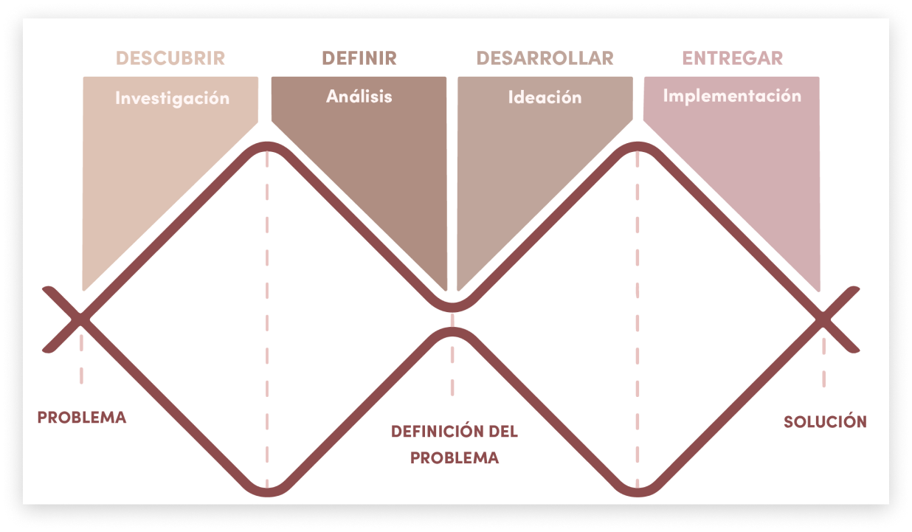

# Proceso de Diseño UX

<figure><figcaption>
Modelo del Doble Diamante. Fuente: Design Council
</figcaption></figure>

Cuando trabajamos en Diseño UX en la industria de la tecnología digital, hay muchas metodologías o _frameworks_ que vamos a escuchar o leer seguido. Entre ellos están el _Design Thinking, Human Centered Design, Lean Startup, Lean UX, Design Sprints_, entre otros.

En realidad ninguna metodología es independiente a la otra, sino que son complementarias o muy parecidas entre sí. Y de hecho, **tienen un gran objetivo en común: aprender.**

El Doble Diamante es una metodología creada en el 2004 por [Design Council](https://www.designcouncil.org.uk/). El primer diamante o etapa se enfoca en el entendimiento del problema, a través de la investigación y análisis. **Es la comprensión del problema que nos permitirá tener una mejor visión y perspectiva del problema especifico a trabajar.**

El segundo diamante comprende la etapa de ideación y de propuesta de solución, en donde se generará la solución o soluciones que busquen resolver el problema especifico. Aquí puedes ver una breve explicación de esta metodología:



### **Paso 1: Investigación**

Es importante definir las características clave de las personas para quienes quieres diseñar, ya que **es necesario que tengan necesidades y/o problemas en común,** de lo contrario será muy difícil crear una solución para todas. Por ejemplo, al realizar las compras del supermercado, un padre de familia tendrá necesidades diferentes a las de una persona que vive sola, por lo que será mejor que en tu investigación incluyas solamente padres o madres de familia.

La técnica más utilizada es la entrevista, puedes iniciar con preguntas básicas como por ejemplo, ¿con cuánta frecuencia realiza sus compras?, para luego profundizar en temas más específicos. **Luego de realizar al menos 3 entrevistas podrás ir identificando necesidades y comportamientos en común,** así como detalles específicos.

### **Paso 2: Análisis**

Durante la investigación vas a generar una gran cantidad de observaciones y anotaciones, las cuales deben sintetizarse para resumir o delimitar las necesidades más frecuentes. Por ejemplo, podrías descubrir que:

* Los usuarios valoran enormemente la conveniencia. Quieren una experiencia de compra rápida y sin complicaciones.
* También aprecian la variedad de productos y ofertas personalizadas en función de sus preferencias de compra.
* La claridad en la presentación de productos y precios es fundamental; desean una navegación intuitiva.

Acá te dejamos un video que explica estos dos pasos, los cuales conforman el primer diamante del modelo.



***

### **Paso 3: Ideación**

Con base en los hallazgos u observaciones de la etapa anterior, podrás **elegir una necesidad específica por resolver** y desencadenar la creatividad durante esta etapa de ideación.&#x20;

Te recomendamos iniciar con ideas abstractas, es decir, una simple descripción de lo que quieres hacer. Por ejemplo, una de tus ideas es crear un "Carrito Express" que permita a los usuarios agregar rápidamente productos y finalizar la compra en unos pocos clics. Otra idea es implementar un sistema de recomendaciones personalizadas en función del historial de compras del usuario. Acá la cantidad es más importante que la calidad.

Una vez que tengas muchas ideas, **elige la que consideres más innovadora** según el problema que deseas resolver. Para pasar de idea a propuesta, recomendamos que realices [bocetos en papel y lápiz](https://coda.io/d/Bootcamp-UX-Contenido\_dqkqk2rV9Z2/Bocetos\_suEli#\_luSLI), ya que podrás pensar libremente, sin batallar con las limitaciones de una herramienta digital en específico. Puedes aprovechar y mostrarle tus bocetos a los usuarios que entrevistaste, así tendrás retroalimentación temprana sobre tu propuesta.

### **Paso 4: Implementación**

Finalmente, tras perfeccionar tus bocetos en papel, **trasladas tus diseños a Figma**. Para mostrar tu propuesta a los demás, es necesario que le des un poco más de detalles a tu solución, esto lo puedes lograr mediante [wireframes](https://coda.io/d/Bootcamp-UX-Contenido\_dqkqk2rV9Z2/Tipos-de-prototipos\_sumFN#\_lu6wf) de las principales pantallas, incluyendo elementos clave como botones y textos principales que ayuden a entender lo que tienes en mente. Recuerda que cada pantalla se diseña pensando en la claridad y simplicidad, priorizando lo que quiere lograr quienes usarán la solución.

Acá encontrarás otro video que resume el segundo diamante del modelo:&#x20;



[Esperamos que esta pequeña introducción te sea de utilidad en tu proceso de postulación al Bootcamp de Laboratoria. **¿Hay algo más en lo que pueda ayudarte?**](#user-content-fn-1)[^1]

[^1]: 
